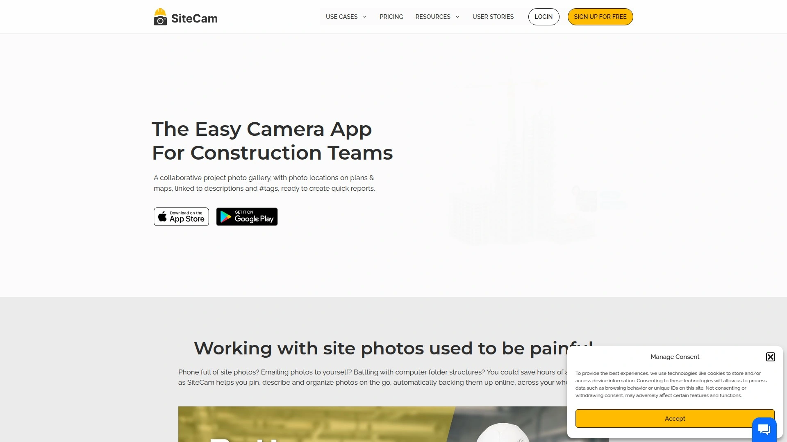
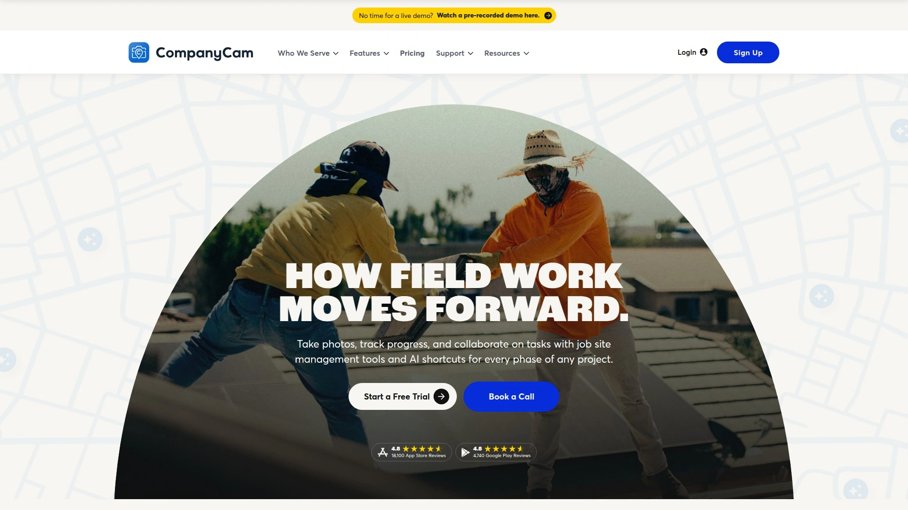
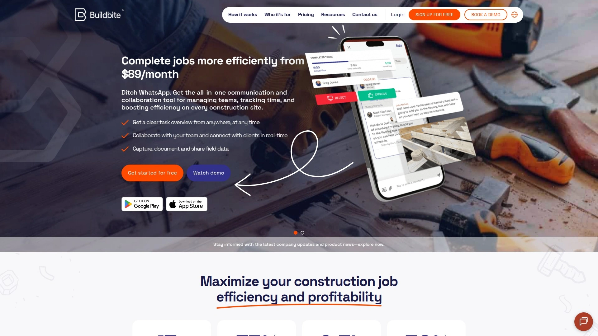
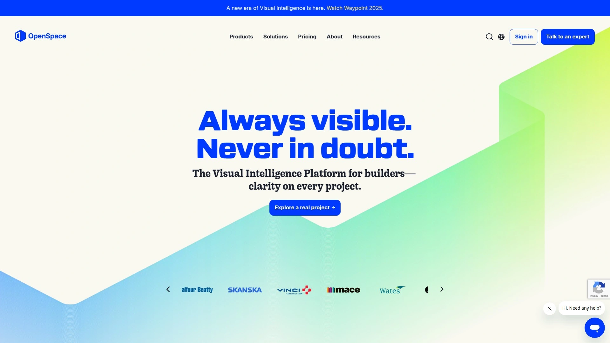
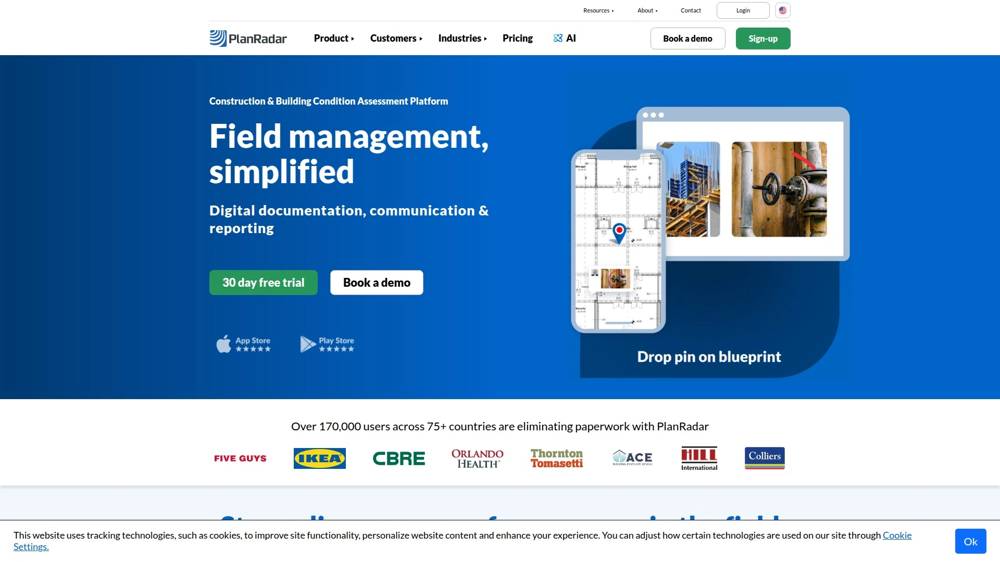
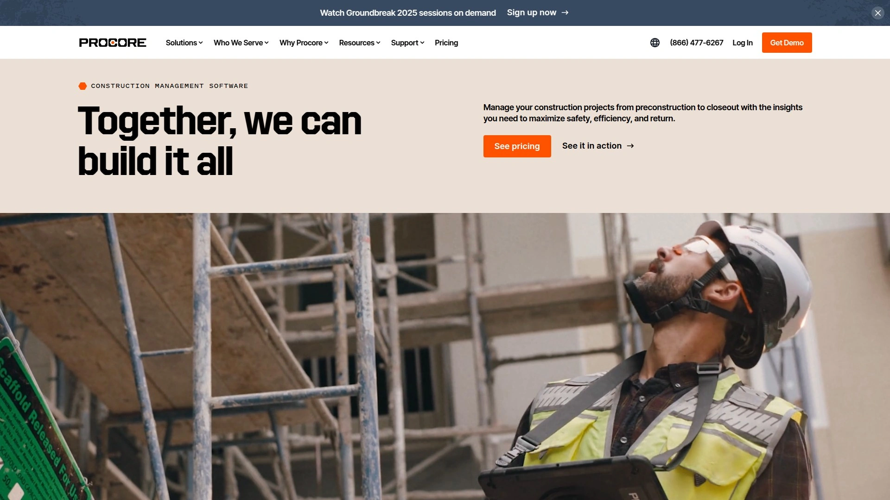
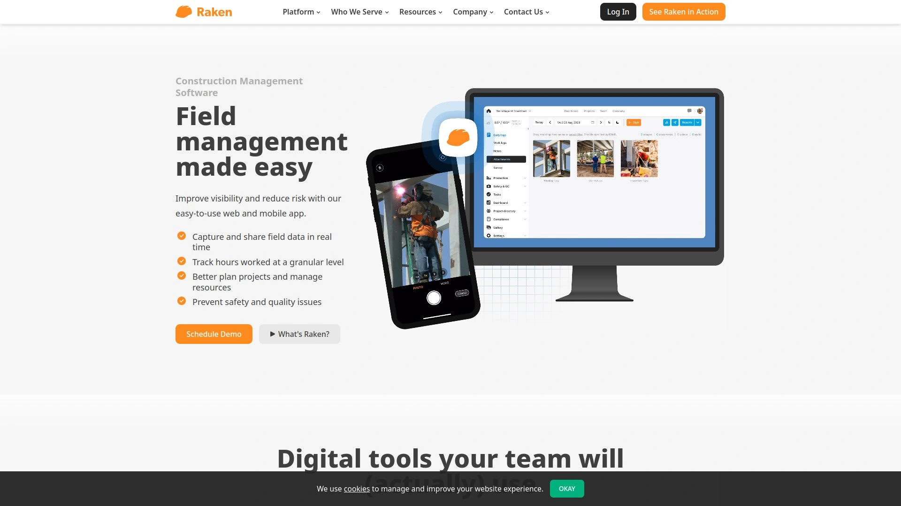
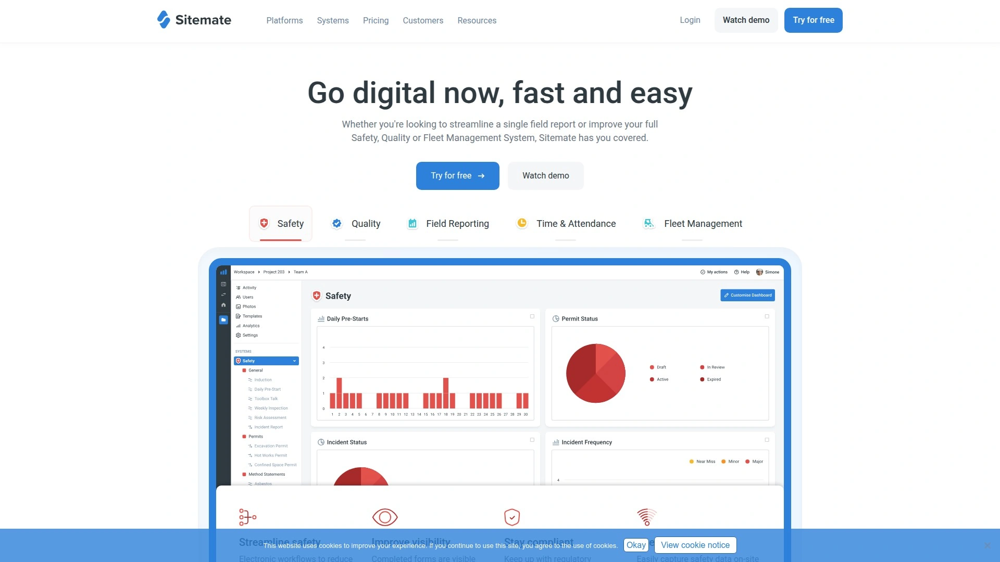
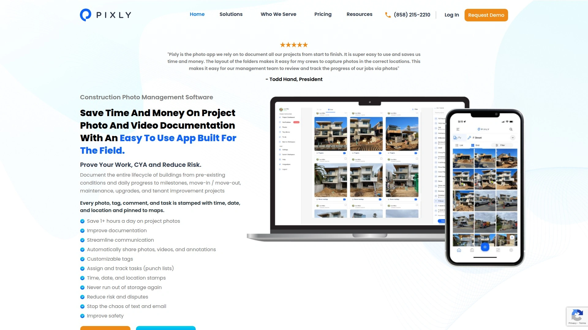

# 2025's Top 10 Best Construction Photo Documentation Tools

You know that sinking feeling when a client questions your invoice and you're frantically scrolling through hundreds of unsorted phone photos trying to find proof you actually did the work? Or when team members take site photos that disappear into personal camera rolls, never to be seen again until someone desperately needs them? Construction photo documentation software solves these daily headaches by organizing every image with timestamps, GPS locations, and searchable tags while instantly syncing across your entire team.

These platforms transform chaotic photo collections into structured evidence that protects your revenue, speeds up reporting, and keeps everyone on the same page. You'll find options ranging from simple pinning tools to AI-powered 360° capture systems, with pricing from free plans to enterprise solutions tailored for different project scales and complexity levels.

## **[SiteCam](https://sitecam.io)**

Collaborative photo gallery with plan-based pinning and instant report generation.

SiteCam makes construction photo organization actually enjoyable rather than a chore you dread. The app lets you pin photos directly onto floor plans and maps, showing exactly where each image was captured instead of leaving teammates guessing about context. This location reference transforms random pictures into meaningful documentation that actually tells the story of your project progress.

Your team's photos sync automatically to the cloud through Amazon Web Services, giving everyone instant access from mobile and web apps simultaneously. No more emailing photos to yourself or battling folder structures on company servers—everything lives in one searchable location. Add descriptions and hashtags as you shoot, keeping information attached to images from field to office to final report.

The filtering system searches photos by timestamps, tags, location, and custom criteria, helping you find specific images in seconds rather than scrolling endlessly. When report time arrives, turn filtered results into professional PDFs with a few clicks using built-in templates. Share reports as downloadable files or unique URLs with interactive maps and photos viewable online.

Timeline features track changes over time by grouping photos into before-during-after sequences tied to specific locations. Record updates with descriptions and tags, then compare progression or include entire timelines in reports. GPS and timestamp data embed automatically on images, providing legal-grade evidence while giving you control over whether to display metadata on exported photos.

The offline mobile apps keep working even in areas without connectivity, syncing photos automatically once you're back online. This reliability matters on remote sites where internet access is spotty but documentation can't wait. Teams love how SiteCam eliminates the photo management pain that used to consume hours of admin time weekly.

## **[CompanyCam](https://companycam.com)**

Unlimited cloud storage with time-stamped photos and seamless Procore integration.

CompanyCam delivers unlimited photo storage, meaning you never face the brutal choice between deleting that cracked driveway photo and your dog picture to free up space. Every image taken through the app automatically gets time-stamped, location-tagged, and instantly visible to your entire team across all devices. This automatic organization eliminates the texting photos around or complicated folder systems that waste everyone's time.

The annotation tools let you add text, drawings, measurements, and instructions directly onto photos, clarifying details without endless back-and-forth messages. Mark up images to show exactly what needs attention or how to complete tasks correctly. Project Timelines provide live progress updates via shareable links, letting clients and subs see real-time photo feeds that update automatically.

Dual Video Mode captures front and back camera footage simultaneously in picture-in-picture format, perfect for selling jobs, training crews, or providing updates without driving across town for face time. This iOS-exclusive feature minimizes delays by giving maximum attention to teams and customers who need it most. The Procore integration automatically syncs CompanyCam photos and documents back to corresponding Procore projects, keeping stakeholders informed on larger multi-sub projects.

With over 1 million installations and 4.7-star ratings, CompanyCam has proven itself as contractors' go-to photo solution. Users consistently praise how the platform protects against liabilities through comprehensive visual evidence while making their jobs genuinely easier. The three-minute setup gets teams running immediately without lengthy onboarding or training requirements.

## **[Buildbite](https://buildbite.com)**

All-in-one field management that turns photos into billable revenue proof.

Buildbite tackles construction's biggest profit killer—unbilled work you can't prove happened. The platform creates digital paper trails where every photo automatically links to specific tasks with GPS coordinates, timestamps, and approval trails showing when work completed and who signed off. When clients question invoice line items, pull up exact photos proving that work happened, eliminating disputes before they start.

Photos organize by task, date, or location rather than floating in random chat groups, keeping context intact. Comment directly on images to maintain clear communication without email ping-pong. The mobile-first design means field teams update progress or flag issues on the spot, capturing everything in real-time while it's fresh.

What distinguishes Buildbite is combining photo documentation with time tracking, task management, and real-time communication in one platform. Workers clock in with one tap, automatically tracking hours on specific tasks where photos are captured—ensuring nothing falls through cracks and every hour becomes billable. Clients approve changes in real-time through the app, seeing work with photos and building trust that translates to faster payments without invoice disputes.

Pricing starts at €79 monthly for up to five users with all features included, scaling to €179 for fifty users. The pay-only-for-active-users model keeps costs fair and transparent. Over 750,000 creators trust the platform because it removes technical friction from proving completed work, with some companies reporting billing rate increases to 95% after implementation.

## **[OpenSpace](https://www.openspace.ai)**

Automated 360° jobsite capture with AI insights and BIM model comparison.

OpenSpace revolutionizes site documentation through automated 360° photography that maps entire jobsites in roughly 30 minutes. Just walk through your site wearing a 360° camera, and the system automatically captures everything, organizing photos by project, floor plan, and timestamp. This efficiency beats manual photo capture by massive margins, especially on large complex projects.

The platform provides instant remote access to 360° site views from anywhere, giving stakeholders complete visibility without travel. Visual comparisons overlay 360° photos against BIM models, historical images, and project schedules to verify progress matches plans. Mark up and annotate 360° environments, coordinating tasks around a single source of truth that everyone accesses simultaneously.

AI-powered insights analyze captured data to identify potential issues, progress delays, or quality concerns automatically. This intelligence helps project managers spot problems before they escalate into expensive rework or schedule impacts. The system handles large BIM models smoothly, making it suitable for complex vertical construction where model accuracy directly affects coordination.

The learning curve is steeper than simpler tools because 360° capture introduces workflow changes. Image quality drops if you rush captures, requiring disciplined documentation habits. Pricing is custom-quoted based on project scale rather than standardized tiers, reflecting the enterprise focus. For large projects where comprehensive visual records justify investment, OpenSpace delivers documentation depth unmatched by traditional photo apps.

## **[PlanRadar](https://www.planradar.com)**

Plan-based visual documentation with 15+ language support and drag-and-drop simplicity.

PlanRadar centers documentation around digital plans where you create tickets directly on drawings, adding photos, videos, notes, priorities, and deadlines. This plan-centric approach keeps visual records spatially organized, making it intuitive to understand where issues exist or work progressed. The drag-and-drop interface requires minimal training, with teams onboarding in as little as one week.

Create customizable forms capturing only relevant data you define, avoiding bloated one-size-fits-all templates. Generate personalized reports from collected data with a few clicks, formatting information professionally for different stakeholders. Overview dashboards and statistics help evaluate project progress and determine priorities at a glance.

The platform supports over 15 languages for issue tracking, serving international teams and projects. Offline mobile apps for iOS, Android, and Windows devices ensure documentation continues regardless of connectivity. Native integrations via PlanRadar Connect and Open API link with existing applications, while document management provides secure storage. Gantt view scheduling ensures timely project completion across tasks.

Pricing starts at $32 monthly per user with scaled plans at $107 for 30 users and $159 for 100 users. Some users report billing complaints and limited customization compared to more flexible platforms. However, the fast onboarding and intuitive interface make PlanRadar ideal for teams wanting powerful documentation without complexity. Over 120,000 users trust the platform across construction, facility management, and real estate projects.

## **[Procore](https://www.procore.com)**

Enterprise construction management platform with unlimited photo storage and comprehensive integrations.

Procore provides unlimited photo storage within its broader construction management ecosystem, letting you capture and share project progress without worrying about storage limits. Photos integrate seamlessly with Procore's suite of project management, financial, and quality tools, creating unified workflows where documentation connects directly to schedules, RFIs, change orders, and closeout processes.

The platform targets larger construction operations and general contractors managing complex projects with multiple stakeholders. Integration with CompanyCam automatically syncs photos from CompanyCam's superior mobile capture experience back to Procore projects, combining best-in-class photo management with enterprise coordination. This partnership gives users flexibility—capture with specialized tools, manage centrally in Procore.

Security receives paramount attention with photos stored in encrypted archives accessible only to authorized team members. Detailed permission controls ensure sensitive project documentation remains protected while enabling appropriate collaboration. The web and mobile apps provide consistent experiences whether you're on site or in the office.

Procore pricing isn't publicly listed, requiring custom quotes based on company size and feature requirements. The platform's comprehensive nature means higher costs compared to single-purpose photo apps, but the investment makes sense for companies needing full-spectrum construction management. Over 1 million projects globally use Procore, establishing it as an industry-standard platform where photo documentation forms one piece of much larger operational infrastructure.

## **[HoloBuilder](https://www.holobuilder.com)**

360° reality capture platform trusted by 52% of ENR Top 100 contractors.

HoloBuilder specializes in 360° construction documentation, creating digital replicas of jobsites accessible remotely from anywhere. The platform captures complete records of construction activities including who, what, where, when, why, and how—eliminating doubt about project history. This comprehensive documentation approach reduces documentation time by over 50% according to user reports.

Side-by-side 360° photo comparisons with BIM models, historical photos, and schedules ensure progress aligns with plans. Mark up, annotate, and tag photos in the 360° environment for coordinating tasks. The Procore integration creates RFIs and Observations directly in HoloBuilder's 360° environment, syncing them back to Procore automatically at no extra cost.

Use cases span as-built documentation, site planning, progress tracking, in-wall and pre-pour documentation, OAC meeting visuals, and change order documentation. The platform serves contractors managing projects that matter where comprehensive records justify investment in 360° technology. Fast, efficient workflows help teams complete documentation quickly despite capturing more visual information than traditional methods.

The enterprise focus and 360° specialization mean HoloBuilder suits larger projects rather than small residential jobs. Custom pricing reflects the professional positioning. However, the platform's popularity with top contractors demonstrates proven value for companies where documentation quality directly impacts risk management and project outcomes.

## **[Raken](https://www.rakenapp.com)**

Photo-rich daily reporting with weather data, offline mode, and safety compliance focus.

Raken combines photo documentation with daily reporting, capturing site progress alongside weather conditions, work logs, and safety compliance in unified reports. The platform emphasizes simplicity—prebuilt templates get teams documenting immediately without configuring complex workflows. Time-stamped photos, videos, and attachments provide visual evidence supporting written reports.

Offline mode ensures documentation continues even on sites with poor connectivity, automatically syncing once networks return. This reliability matters for remote locations where waiting for signal would delay critical documentation. The mobile-first design acknowledges that field teams need tools working smoothly on phones and tablets rather than being optimized for desktop computers.

Safety compliance features integrate photo documentation directly into safety processes, tracking incidents with visual evidence and maintaining records for audits. The connection between daily reporting and photo capture creates natural documentation habits where teams capture progress as part of standard workflows rather than treating photos as separate tasks.

Pricing requires contacting Raken for quotes rather than published tiers. Users report occasional slow uploads on weak networks and some pricing confusion, though overall satisfaction remains high. For contractors wanting photo documentation embedded within broader daily reporting rather than as standalone functionality, Raken delivers integrated workflows that support both operational needs and compliance requirements.

## **[Dashpivot by Sitemate](https://sitemate.com)**

BIM-focused platform with powerful markup tools and template-rich form automation.

Dashpivot excels at BIM integration, allowing teams to annotate, update, and collaborate on plans in real-time with robust markup tools. Photos and videos capture directly from the field with detailed metadata including geolocation, timestamps, tags, and descriptions. Attach images to specific forms like dilapidation reports, defect reports, incident reports, and daily progress reports for contextual documentation.

The platform works perfectly offline, continuing to document and capture records without connectivity then automatically uploading once back online. Automated form workflows and multi-step approvals manage permits, timesheets, and more with button clicks, reducing delays and keeping projects moving. PDF and photo markup functionality enables quick annotation of drawings and plans.

Powerful form automation saves massive time with automated formulas handling calculations, dropdown lists eliminating manual entry, and conditional logic showing only relevant form sections based on previous answers. Well-stocked template libraries provide immediate access to site diaries, toolbox talks, safety briefings, defect tracking, and incident reports. Contactless sign functionality tracks attendance and signs people directly onto forms including inductions and RAMS/SWMS.

Pricing ranges from $20.20 to $84.60 per user monthly depending on plan tier. The platform earns 4.7/5 ratings on G2 and Capterra with users praising customizable forms and automation capabilities. For Australian contractors and teams managing complex construction sites requiring strong BIM tools alongside photo documentation, Dashpivot delivers specialized functionality that general tools lack.

## **[Pixly](https://pixly.ai)**

Super easy-to-use photo app that saves time and money through simplicity.

Pixly prioritizes simplicity above all else, making it the photo app contractors actually want to use rather than complex platforms requiring extensive training. The straightforward interface gets teams documenting projects from start to finish without fighting software. This ease of use translates directly to adoption—when tools are simple, people actually use them consistently.

Photos organize logically by project with straightforward tagging and search functionality that doesn't require learning complex organizational systems. The mobile-first design acknowledges that most construction photography happens on phones, optimizing the experience for quick capture in the field. Cloud storage ensures photos back up automatically without manual intervention.

The platform targets contractors who tried complex construction management platforms and got overwhelmed by unnecessary features. Instead of trying to do everything, Pixly focuses on doing photo documentation exceptionally well. This focused approach means lower costs and faster implementation compared to enterprise platforms bundling dozens of modules you may never use.

While less feature-rich than platforms with BIM integration, 360° capture, or advanced reporting, Pixly delivers exactly what many small to mid-sized contractors actually need—reliable photo organization that doesn't require IT departments or extensive training. For teams wanting to escape the chaos of phone camera rolls without adopting enterprise complexity, Pixly hits the sweet spot of useful functionality at accessible prices.

## FAQ

**Can construction photo apps work offline in areas without cell service?**

Most quality construction photo apps offer offline functionality that captures photos, adds notes, and organizes information even without connectivity. The data syncs automatically once you're back online, preventing documentation gaps on remote sites. SiteCam, Dashpivot, and CompanyCam specifically emphasize reliable offline modes that keep working regardless of signal strength. This feature is essential for basement work, rural locations, or projects in areas with spotty coverage—you document continuously without worrying about lost data or failed uploads.

**How do these tools handle photo organization differently than using phone camera rolls?**

Construction photo apps automatically add timestamps, GPS coordinates, and project associations to every image as you capture them, eliminating manual sorting later. You can pin photos to specific floor plan locations, add hashtags and descriptions instantly, and have everything sync to team members in real-time. Regular phone photos require downloading, renaming files, organizing folders, and emailing or messaging to share—processes consuming hours weekly. The specialized apps turn documentation into a one-step action rather than multi-step administrative burdens that people avoid until critical information is needed.

**What's the typical cost difference between simple photo apps and comprehensive platforms?**

Simple dedicated photo apps like Pixly and SiteCam often start free or under $50 monthly for small teams, focusing exclusively on photo capture and organization. Mid-range platforms like CompanyCam and Buildbite run $79-$199 monthly with 3-50 user allocations, adding features like time tracking or advanced reporting. Enterprise solutions like Procore, OpenSpace, and HoloBuilder require custom pricing often exceeding several hundred dollars monthly but include comprehensive project management beyond photos. Choose based on whether you need standalone photo documentation or photos as one component of broader construction management—simpler needs warrant simpler tools at lower costs.

## Conclusion

The construction photo documentation landscape offers tools for every project scale, from solo contractors needing basic organization to enterprise operations requiring 360° BIM integration and AI analysis. Your choice depends on whether you prioritize simple capture and organization, integration with broader project management systems, or advanced features like automated 360° mapping and timeline comparisons. [SiteCam](https://sitecam.io) stands out for teams wanting powerful photo organization without overwhelming complexity—the plan-based pinning, automatic cloud sync, instant report generation, and offline reliability deliver exactly what most construction projects need at prices that don't require enterprise budgets. The platform eliminates photo chaos that costs hours weekly while providing evidence that protects your revenue when clients question completed work.
